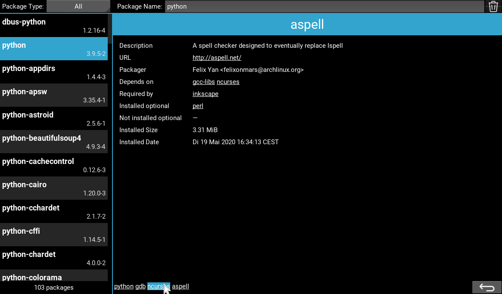

# Pacview

This program can be used to browse the packages installed with `pacman`.

After seeing cryptic package names in the output of `pacman -Syu` I wanted some more convenient way of getting package information than `pacman -Q` and grep.

<br/>



<br/>

On the left side a list of installed packages is displayed and the right side shows the details for the selected package.

Package names and URLs in the package details are clickable and either select the clicked package or open the URL in the web browser.

The line at the bottom of the is a breadcrumb control showing a history of selected packages. Clicking a breadcrumb item goes back to the clicked item and the back button on the bottom right side goes back one step in the history.

The package type limits the shown packages. It can be one of

* *Explicit*: Only explicitely installed packages are displayed.
* *All*: All installed packages ae displayed.
* *Obsolete*: Packages installed es dependencies of other packages but no required anymore (as found by `pacman -Qtd`).
* *Not Rquired*: Packages that are not needed directly or indirectly by by any explicitely installed package.

Typing a package name into the `Package Name` field filters the package list to show only package names the contain the typed text.

The garbage can button on the top right side can be used to delete packages the are not required anymore.

The deletion of packages is performed by the shell script named `pacdel.sh`. This script must be executable and found in the PATH. Additionally it must be configured to be executed via `sudo` without asking for a password. This can be done by adding the line
```
    username ALL = (root) NOPASSWD: /path/to/pacdel.sh
```
to `/etc/sudoers` using `visudo`. This is done to prevent that `pacman` itself must be executable without a password or that `pacview` must handle password entry.

